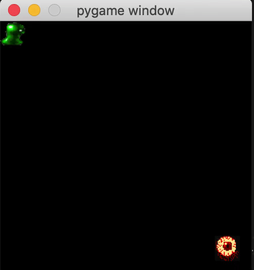

# Runaway



Runaway is a Reinforcment Learning environment developed in pygame.  The object of the game is to avoid being captured by the evil minion that is chasing after you for as long as possible.

# State
The state of the environment is represented as a vector of the 5 numbers:
    1. the x posistion of the player
    2. the y position of the player
    3. the x position of the minion
    4. the y position of the minion
    5. the euclidian distance between the player and minion

# The Minion policy
The policy that the minion follows is to always take the move the minimizes the distance between the player and minion.


# Game modes
There are two game modes.  One where you can input commands via the keyboard to move the player around the game board to avoid the minion chasing after you.  Or you can use a DQN model to make moves for you.

# Built-In DQN
Built into the environment is a trainable DQN agent.  Models trained for various numbers of episodes are housed in the models folder.

# Getting started:

To get started run the following code to download the repo, create a virtual env, install the dependencies, and start up a human controlled match:
```
git clone https://github.com/loftiskg/runaway.git
cd runaway
python -m venv env
source env/bin/activate
pip install -r requirements
python play.py
```

To use a DQN agent to play the game run the following:

```
python play.py --agent agent --agent_model_path ./models/model_2.pt
```

