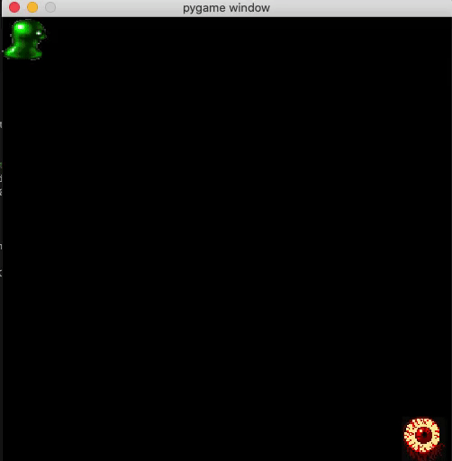

# Runaway


Runaway is a Reinforcment Learning environment developed in pygame.  The object of the game is to avoid being captured by the evil minion that is chasing after you for as long as possible.  A player wins the game if the minion is avoided for d1000 timesteps (roughly 20 seconds), otherwise the game is lost.  Additionally, as part of this project I demonstrate how tabular Q-learning can be utilized to learn an optmial policy of the game.

A short video presentation can be found here discussing how I trained an agent using Q-learning to play the game:
[](https://youtu.be/1mwcbWFazXE)

# Environment and State
The state of the environment is represented as a vector of the 5 numbers:
    1. the x posistion of the player
    2. the y position of the player
    3. the x position of the minion
    4. the y position of the minion
    5. the euclidian distance between the player and minion

# Actions:
The player avoids the minion chasing after by moving around the 2D game board.  The player can take the following actions:
- Move up (up keyboard arrow)
- Move down (down keyboard arrow)
- Move left (left keyboard arrow)
- Move right (right keyboard arrow)
- Stay put (no action)

If the player hits a wall the player stays in the same position.

# Rewards
Rewards are given as follows:
- 1 reward is given for each timestep the minion is alive
- 1000 rewards are given if the player wins (survives for 1000 timesteps without being captured)
- -100 rewards are given if the player is captured, ie. the player loses

# The Minion policy
The Minion chasing the user follows a policy that always take the move the minimizes the distance between itself and the player.

# Game modes
There are two game modes.  One where you can input commands via the keyboard to move the player around the game board to avoid the minion chasing after you.  Or you can use a model learned by Q learning to make moves for you.

# Q-learning agent
Built into the environment is a trainable TD agent that can learn an optimal policy to play the game.  Pretrained models can be found in `models/`

# Summary of results:
I trained the agent using a decaying epsilon greedy policy where the start epsilon was set at 1 and every episode epsilon was decayed at a rate of 0.995 until it reached a minimum of 0.001 where it stay constant for the rest of training.  I trained the agent for a total of 5000 episodes.  Below is a plot showing the 50 episode moving average of the rewards obtained during training, an animation of the agent following the policy learned, and an animation of the agent following a completely random policy for comparison:




The agent converges when the rewards obtained consistantly reaches above 1250.  From the plot, the agent converges after about 2000 episodes.

# Getting started:

To get started run the following code to download the repo, create a virtual env, install the dependencies, and start up a human controlled game:
```
git clone https://github.com/loftiskg/runaway.git
cd runaway
python -m venv env
source env/bin/activate
pip install -r requirements.txt
python play.py
```

To train a Q learning agent to play the game run the following:

```bash
# this will save the Q values in the models directory with the name Q_model_e10000_epsilon0.001_1.pkl
python train.py --episodes 5000 --epsilon 1 --epsilon_decay .995 --min_epsilon .001 --save_model --save_plot --save_rewards --suffix "decay"  --print_every 100 
```
This will recreate the results seen above

To render the trained agent run the following command:
```
python play --agent q --agent_model_path  models/Q_model_e5000_epsilon1.0_decay.pkl
```

