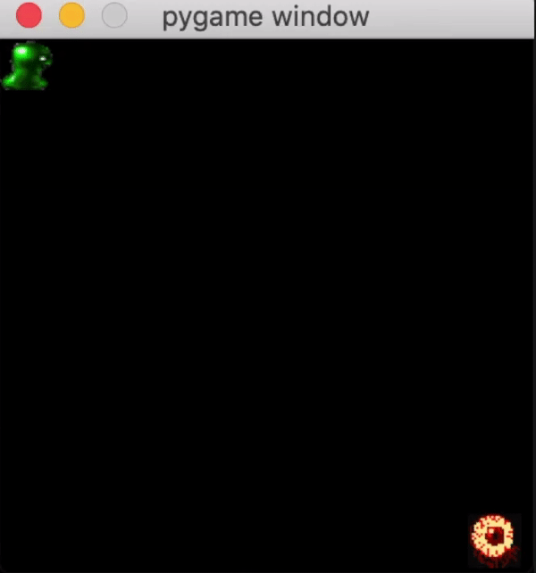
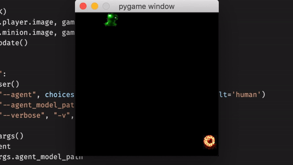
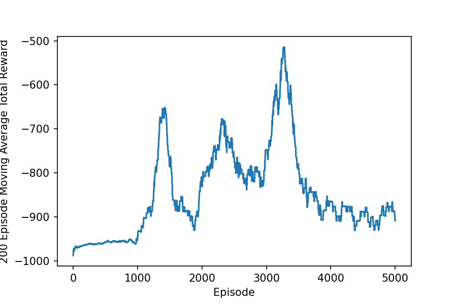

# Final Project Check-in

## Name: Kevin Loftis

## Finalized Research Question:
Can build a game/environment called Runaway (see README for details) and train a Deep Q-Network agent to play it?

## Environment:
Custom built for this project.  The environment class is called Game in src/game.py.

## Random Agent:
Random Agent is in src/agent.py.  The class name for ranomd Agent is Random_Agent.  The agent is the green slime, and the minion is the floating eyeball.

## RL Agent:
The RL agent lives in src/agent.py.  The class name for the RL agent is DQN_Agent.

Total rewards over time.

To finish the project I need to train my agent for longer.